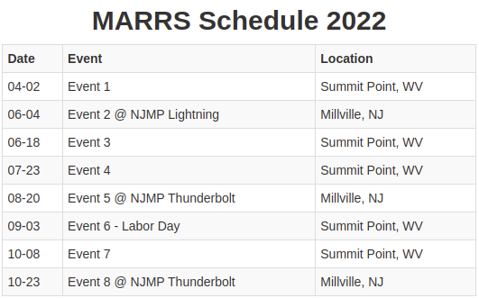

# eventlist
A service to manage and display your list of events.  Build your list of events once, display it across multiple websites and services.

## Event List Main Features
- FREE Web based list of events
- E-mail or username user account authentication
- Multiple event calendars per user
- REST API
- Javascript SDK
- Share as simple URL
- Embeddable by javascript or an iframe
  - Embed into websites
  - Facebook
  - Twitter
- Each event has the following properties:
  - Event List Title
  - Multiple Event Lines with:
    - Date (Selectable formats)
    - Event Name (Linkable to external websites/URLs)
    - Location (Linkable to map location)
    - Other

## Example Event List from [MARRS Points](http://marrspoints.com/) application

